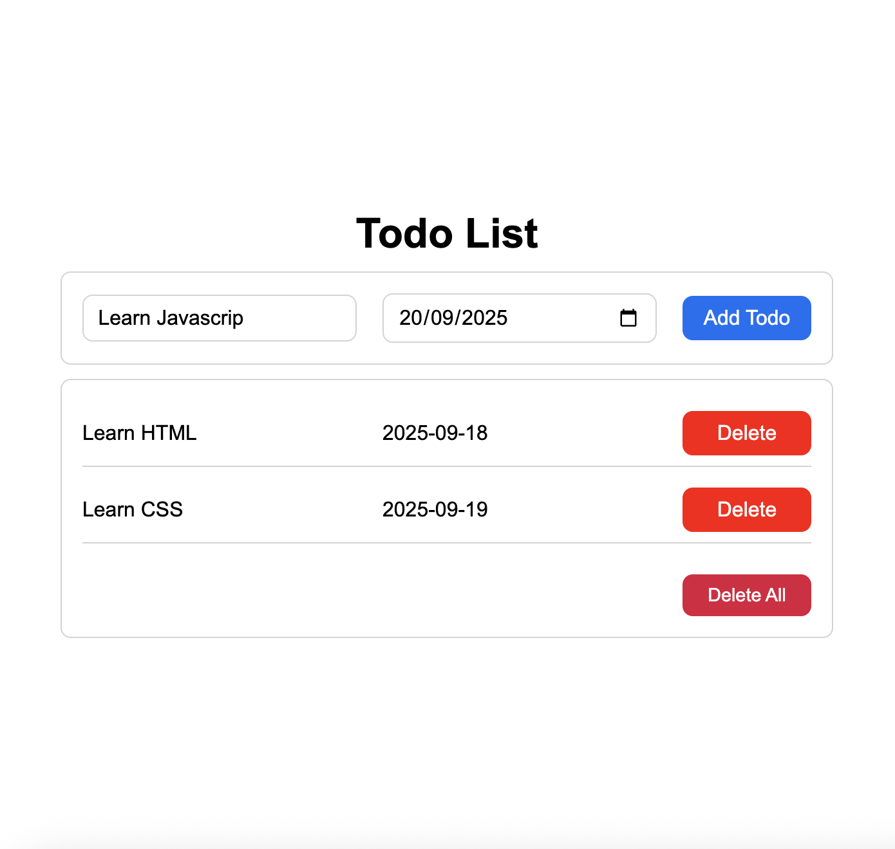

# Todo List App

A simple, clean todo list application built with vanilla HTML, CSS, and JavaScript. The app allows you to add tasks with due dates and automatically saves your data to localStorage so your todos persist between browser sessions.



## Features

- **Add Tasks**: Create new todos with a name and due date
- **Delete Tasks**: Remove completed or unwanted tasks
- **Persistent Storage**: All todos are automatically saved to localStorage
- **Clean UI**: Simple, responsive design with visual separators between tasks
- **Date Picker**: Built-in date input for setting due dates

## How to Use

1. **Adding a Todo**:

   - Enter your task name in the "Todo name" field
   - Select a due date using the date picker
   - Click "Add Todo" button

2. **Deleting a Todo**:

   - Click the red "Delete" button next to any task to remove it

3. **Data Persistence**:
   - Your todos are automatically saved and will be there when you reload the page
   - No account or server required - everything is stored locally in your browser

## File Structure

```
todolist/
├─ index.html            # Main HTML structure
├─ script.js             # JavaScript functionality and localStorage logic
├─ style.css             # CSS styling and layout
├─ images/
│  └─ todolist_screenshot.png
└─ README.md
```

## Technical Implementation

### HTML Structure

- Clean semantic HTML with form inputs for todo name and date
- Container-based layout for easy styling
- JavaScript class selectors for DOM manipulation

### CSS Features

- Flexbox layout for responsive design
- Max-width containers (600px) for optimal readability
- Visual separators between todo items
- Rounded corners and consistent spacing
- Button hover states and clean typography

### JavaScript Functionality

- **localStorage Integration**: Automatically saves and loads todo data
- **Dynamic Rendering**: Generates todo HTML dynamically
- **Event Handling**: Manages add/delete button clicks
- **Data Management**: Array-based todo storage with JSON serialization

## Getting Started

1. Clone or download the files
2. Open `index.html` in your web browser
3. Start adding your todos!

No build process or dependencies required - just open and use.
